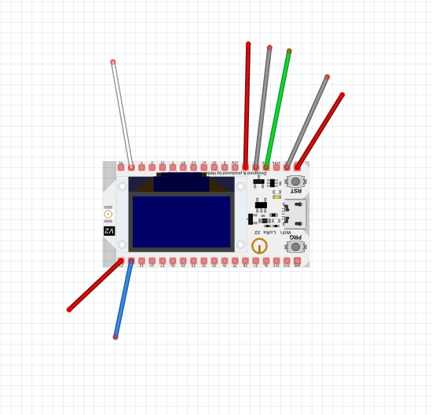

# 1D-pong

This is an ESP32 (at least that) version of the all well known warareg 1-D Pong game
also known as `one_d_pong`. 
This version is a fork from [Computer Truhe Project](https://git.chch.it/rob/1D-pong).

This is a linear pong game where the bat is a home area of about 7 pixels. Depending on
how deep you let the ball run into your home area, the faster it is repelled. If you 
fail to press the button in time you loose a point since the ball enters your home.
This version supports a boost button which sacrefies one pixel of your home area in 
favor of boosting your ball faster.

# Notes
Some pins do not allow to configure Pull up resistors or work only as output. Don't use them.

We used Mouse devices which where re-soldered to use the 4 USB wires as 'short to GND' to work as controllers. 
That is, each button got explicitly one of the Din, Dout, Vcc wires and shorts it to the GND wire of USB.
USB plugs where of course snipped off.
We also did re-solder some of the existing capacitors of the USB-logic board and put them in parallel to the
switch to suppress electric bouncing of the switch signal.

One way of wiring everything up (you can vary for geometry reasons) can be seen here.
We respected the types of PINs and their capability. i.e. all switch pins must support
pull up resistors (configurable property of ESP32) and work as digital input. 
The buzzer sound pin must be supported by the PWM generator. (Not yet used by the code)

 
